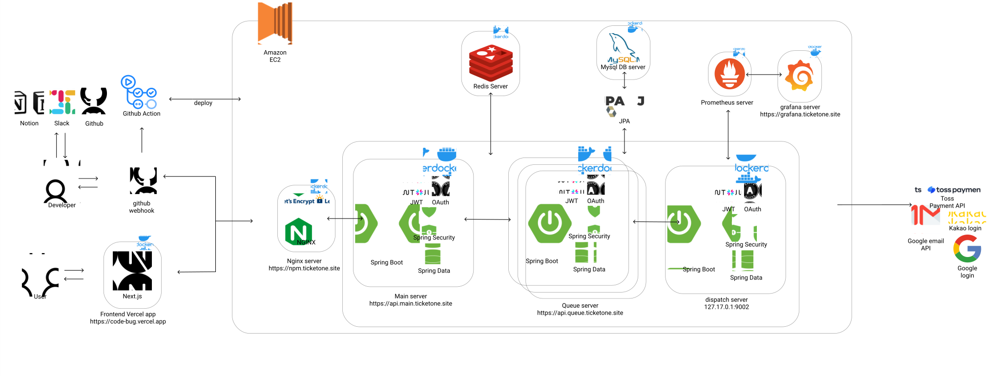

# WEB4_5_CodeNBug_BE

 
 

## 티켓 온(Ticket-On)

|                                                        김지우                                                        |                최재우                 |                박종현                 |                박현모                 |                장선호                 
|:-----------------------------------------------------------------------------------------------------------------:|:----------------------------------:|:----------------------------------:|:----------------------------------:|:----------------------------------:|
|  |  |  |  |  |
|                                                        TL                                                         |                 PO                 |                 TM                 |                 TM                 |                 TM                 |
|                                      [GitHub](https://github.com/omegafrog)                                       |             [GitHub](https://github.com/cjw0324)             |             [GitHub](https://github.com/joungGo)             |             [GitHub](https://github.com/Emokido)             |             [GitHub](https://github.com/ohnoesganj)             |

 
 

# ☕ Project Overview

## 1. 프로젝트 명

**티켓온 (Ticket-On)** - 고성능 대용량 트래픽 처리 티켓 예매 시스템

 

## 2. 프로젝트 소개

티켓온은 **대용량 트래픽**과 **동시성 문제**를 해결하기 위해 설계된 분산 티켓 예매 시스템입니다.

### 🎯 핵심 가치

- **높은 동시성 처리**: Redis 분산 락을 활용한 좌석 예매 동시성 제어
- **대기열 시스템**: Queue 서버를 통한 트래픽 분산 및 공정한 예매 기회 제공
- **실시간 알림**: SSE를 활용한 실시간 예매 진행 상황 및 알림 전송
- **마이크로서비스 아키텍처**: 서비스별 독립적인 확장과 배포 가능
- **안정적인 결제**: 토스페이먼츠 연동으로 안전한 결제 시스템 구현

### 🏗️ 시스템 구성

- **Main Server**: 핵심 비즈니스 로직 (사용자, 이벤트, 좌석, 결제 관리)
- **Queue Server**: 대기열 시스템으로 트래픽 제어 및 순서 보장
- **Message Dispatcher**: 서비스 간 메시지 전달 및 이벤트 처리
- **User Service**: 사용자 인증 및 권한 관리
- **Common**: 공통 유틸리티 및 설정

 

## 3. 주요 기능

### 🎫 **티켓 예매 시스템**

- **지정석/미지정석** 예매 지원
- **실시간 좌석 상태** 확인 및 Redis 캐싱으로 빠른 응답
- **분산 락 기반** 동시성 제어로 중복 예매 방지
- **최대 4매** 동시 예매 제한

### ⏰ **대기열 시스템**

- **Redis ZSet 기반** 공정한 대기 순서 관리
- **SSE 실시간** 대기 순서 및 진입 알림
- **토큰 기반** 예매 권한 검증

### 💳 **결제 시스템**

- **토스페이먼츠 연동**으로 안전한 결제 처리
- **결제 전 좌석 임시 예약** (5분 TTL)
- **결제 실패 시 자동 좌석 해제**

### 🔔 **실시간 알림**

- **SSE 기반** 실시간 알림 전송
- **예매/결제/취소** 상태별 알림
- **미읽은 알림** 관리 및 재전송 지원

### 👤 **사용자 관리**

- **JWT 기반** 인증/인가 시스템
- **OAuth2** 소셜 로그인 지원
- **역할별 권한** 관리 (ADMIN, MANAGER, USER)

[✨ 기능 명세서 ✨](docs/기능_명세서.md) 
[✅ Redis가 적용된 기능의 Process ✅]()
 
 
 

# 🛠️ Tech

## 기술 스택
### 💻 언어

  
  

 

### ⚙️ 프레임워크 및 라이브러리

  
  
  

 

### 🗄️ 데이터베이스

  
  
  

 

### 🛠️ IDE 및 개발 도구

  
  
  
  
  

 

### 🌐 통신 및 네트워크

  
  

 

### 🔗 버전 관리 및 협업 도구

  
  
  
  
  

## ERD

## System Architecture

## Sequence Diagram

## 브랜치 전략
[🔧 GitHub Flow Convention 🔧]()

## API 명세서

[🔖 API 명세서🔖 ](docs/API 명세서.md)
 
 

## 컨벤션

[📌 Code Convention 📌]()
